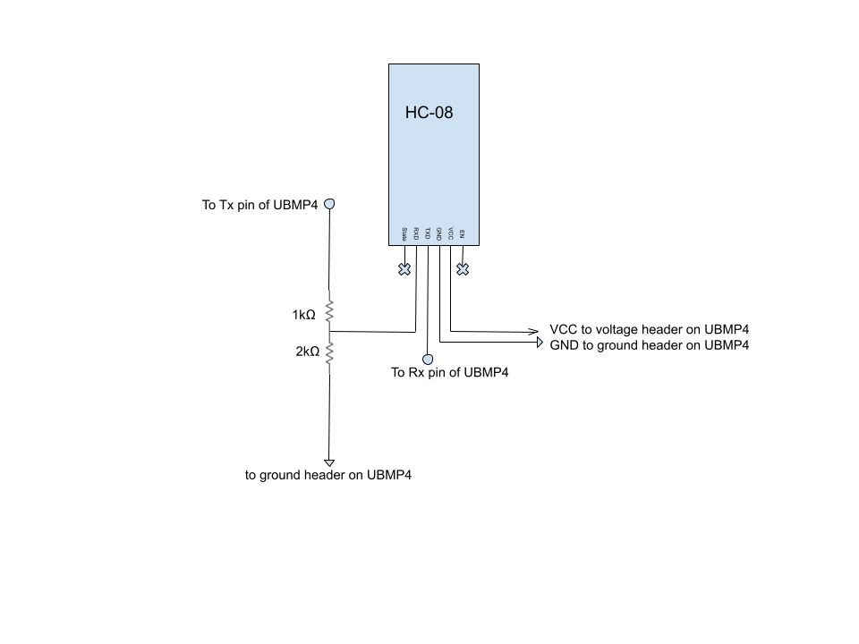

# **UBMP4-Music-Player**

## **What is this project about?**

This is a project for the UBMP4, designed to play relatively complex music, created via Microchip's MPLAB Xpress IDE.

## **Who is this project for?**

This is a personal project, however, anyone who would like to use this code, or modify a copy, is welcome to do so.

## **Hardware**

This project uses a UBMP4.1 with a few added changes:

1. Resistors R4 and R6 are removed and replaced with headers.
2. These headers are connected to a bread board using wires.
3. The bread board contains an HC-08 BLE module, a 1k<html>&#8486;<html/> resistor, and a 2k<html>&#8486;<html/> resistor which are used to divide the voltage coming from the UBMP4's Tx pin to 3.3v from 5v for the module's Rx pin.
4. The UBMP4 has a larger piezo buzzer added, however, the on board buzzer should suffice.

Bread board schematic:

## **How to install**

This project can be cloned to MPLab and compiled, then it can be sent to the UBMP4 through the usb-c connection.

The android app can be found at its github page and is currently not on the app store and is currently designed to run through the use of android studio.

## **Instructions**

1. Give the UBMP4 power by connecting it to a 5 volt supply or by plugging a usb-c cable into the board and a 5 volt supply.
2. Press button SW2.
3. Open the Android application.
4. Allow bluetooth and location permissions (not doing this will cause the app to break or close!)
5. Press scan
6. Tap the pause/resume button to pause/resume the music

## **Project limitations**

The UBMP4 uses a PIC16F1459 microcontroller, notable features include: 

- 8k words of program FLASH (6k when using USB bootloader)
- 128B of user FLASH
- 1kb of RAM

The UBMP4 has one built-in piezo buzzer, more can potentially be added, but in this project we will only be using the one.
More information can be found at the [UBMP4 website](https://mirobo.tech/ubmp4) and [Microchip's site for the microcontroller](https://www.microchip.com/en-us/product/PIC16F1459)

## **Features**

### Sound creation

The sound is created by a fractal-esque process, where the program cycles through a 'while' loop to subtract from a counter that determines the pitch of the sound. 

Then it checks for timbre by an effect variable, which is determined by the desired duty cycle. 6.25% appears to be the most pleasant sound, while 50% is the actual pure pitch. For example, if 
the counter variable is 160 and the effect variable is 4 then it would shift it right by 4 (effectively dividing by 16) to get 10 (6.25%). Once it is below that number, the note plays.

This process is repeated for each channel.

Finally, the program gets to a master counter which is based on the desired sampling frequency (in this case 220khz) and is responsible for handling the rhythm events, and the aquisition of new pitches, rhythms, and effects
from the Android application.

The way that this is implemented requires extreme speed to prevent potential parasite tones which may arise. This is because it uses a method called pulse interleaving (PIM) which creates the two sounds by alternating between them extremely quickly. 
These are tones created by the brain when two pitches are alternated between. Luckily, they exit the range of human hearing if the rate at which the notes alternate is fast enough.

I mentioned that this is created by a fractal-esque process, which it may not seem like at first, however this is because it is based on a simpler implementation using nested 'if' statements[1](#myfootnote1): 

	PORTB = output1 & output2 & output3 & output4;
	if(pitch_counter -- == 0)
	{
		pitch_counter = FREQUENCY;
		output1 ^= 1;
		if(effect_counter -- == 0)
		{
			effect_counter = EFFECT;
			output2 ^= 1;
			if(rhythmic_counter -- == 0)
			{
				rhythmic_counter = RHYTHMIC;
				output3 ^= 1;
				if(structural_counter -- == 0)
				{
					structural_counter = STRUCTURAL;
					output4 ^= 1;
				}
			}
		}
	}

<a name="credit">1</a>: Credit goes to Dr. Blake 'PROTODOME' Troise, his website and more information on 1-bit music can be found [here](https://phd.protodome.com/)

### Android App

An Android application is responsible for communicating pitch, effect, and rhythm data to the UBMP4 in order to reduce the usage of the limited size of the PIC. This is done through an HC-08 Bluetooth Low Energy module.
The UBMP4 sends a value to the BLE module through UART and the module sends it to the app, after which it responds with a given value depending on what value it received.

More information can be found at the app's github.

## **The Future...**

I originally planned to have more features in the app, such as the ability to read music off of a file (e.g. txt), however, do to time limitations I was unable to accomplish this. In the future I plan to add features such as those, and to continue
to bug-fix the code. Perhaps I could even make it read midi or wav files. <html>&#129300;<html/>

Overall, this has been a wonderful year, I learned so many things and made some great friends along the way! Thanks everyone who could make this happen! See you next year, maybe I'll be doing something even crazier then!